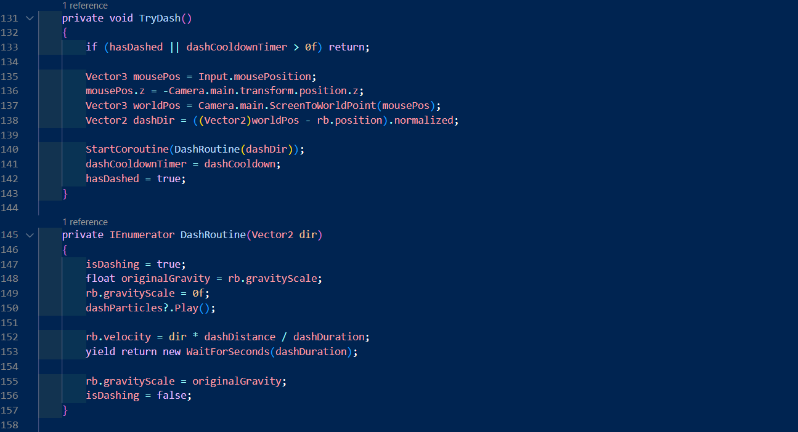

# 2025CT_Sebastian.L_Thera.T

# Ramen Run

## Gameplay Showcase

## Description
This game was made as part of a project for a school assignment. The intended topic and idea revolved around the theme "Games for change" although through taking influence from multimedia partners the thematic details and creative design changed,although the core intended gameplay remained relatively similar. In the game you play as an imperial dynasty chef, collecting ingredients across the land. The game includes multiple platforms and obstacles aswell as jumps and falling objects making platforming challenging and interesting.

## Objective
The objective of the game is to collect all the necessary ingredients to make soup while avoding obstacles and scaling the terrain. The player will encounter numerous obstacles like enemies(not done yet), falling obstacles and challenging jumps. Your goal is to beat multiple levels, collecting ingrediants without dying in order to create a meal to the king. By doing so, the main character is able to return home with collected funds.

# User Documentation

## Controls

| Action  | Output |
| ------------- | ------------- |
| Spacebar | Jump  |
| D  | Forward/Move Right |
| A | Backwards/Move Left |
| Shift | Dash  |
| Cursor | Aiming dash |

## Jump

The longer the jump button is held, the higher the player jumps — allowing for precise control over jump height and timing.

## Coyote Jump

Allows players to jump shortly after leaving a platform, giving a small grace period to make jumping more forgiving and responsive. This improves platforming feel and reduces frustration from near miss jumps.

## Dashes

The Mouse-Aimed Dash mechanic allows players to quickly dash in the direction of their mouse cursor, offering precise control and dynamic movement.

## PlayerMovement Code (Dash Feature)

# Assets
[View Assets](https://drive.google.com/drive/folders/1jqBWPJA-WdNTHMVoVVEi342WFsgfYDFL?usp=drive_link)

# Acknowledgements
### Sprite Creator - (thera.tran765@education.nsw.gov.au)
### Tile map used - [pixel frog - Treasure Hunters](https://pixelfrog-assets.itch.io/treasure-hunters)

# Videos Used

#### [2D platformer animations - Game Code Library](https://www.youtube.com/watch?v=Sg_w8hIbp4Y&t=295s&pp=0gcJCQYKAYcqIYzv)
#### [Platformer Dash - Bendux](https://www.youtube.com/watch?v=2kFGmuPHiA0&t=51s)
#### [Scrolling Background - Root Games](https://www.youtube.com/watch?v=Wz3nbQPYwss&t=8s)
#### [Tilemap and rule tiles - Pixel Pete](https://www.youtube.com/watch?v=rC55Q7p90qs)
#### [Tilemaps + Collision](https://www.youtube.com/watch?v=8UctaO5DwUE&pp=0gcJCQYKAYcqIYzv)
#### [Falling obstacles - Game code library](https://www.youtube.com/watch?v=xx1oKVTU_gM&t=181s)
#### [Coin system - MoreBBLAKEYY](https://www.youtube.com/watch?v=5GWRPwuWtsQ&t=109s)

## License
This project is licensed under the GNU Public License - see the LICENSE.md file for details.
